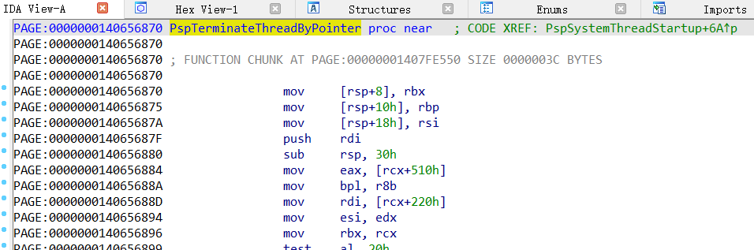

# EasyPdb

A very simple C++ library for download pdb, get rva of function, global variable and offset from struct.




---

# usage

```cpp
#define _CRT_SECURE_NO_WARNINGS
#include <Windows.h>
#include <stdio.h>
#include "EzPdb.h"


int main()
{
	// 1.download pdb from microsoft server
	// if you want to use local pdb, just skip EzPdbDownload
	std::string kernel = std::string(std::getenv("systemroot")) + "\\System32\\ntoskrnl.exe";
	std::string pdbPath = EzPdbDownload(kernel);
	if (pdbPath.empty())
	{
		std::cout << "download pdb failed " << GetLastError() << std::endl;;
		return 1;
	}

	// 2.load pdb file to current process's memory
	EZPDB pdb;
	if (!EzPdbLoad(pdbPath, &pdb))
	{
		std::cout << "load pdb failed " << GetLastError() << std::endl;
		return 1;
	}

	// 3.get function/variable rva
	ULONG rva = EzPdbGetRva(&pdb, "NtTerminateThread");

	// 4.get struct property's offset
	ULONG offset = EzPdbGetStructPropertyOffset(&pdb, "_KTHREAD", L"PreviousMode");

	printf("%x %x\n", rva, offset);

	// 5.unload pdb
	EzPdbUnload(&pdb);

	return 0;
}
```

---

# Thanks

https://github.com/Broihon/Symbol-Parser

https://github.com/pod32g/MD5

https://stackoverflow.com/questions/3092609/how-to-get-field-names-and-offsets-of-a-struct-using-dbghlp-and-pdb
