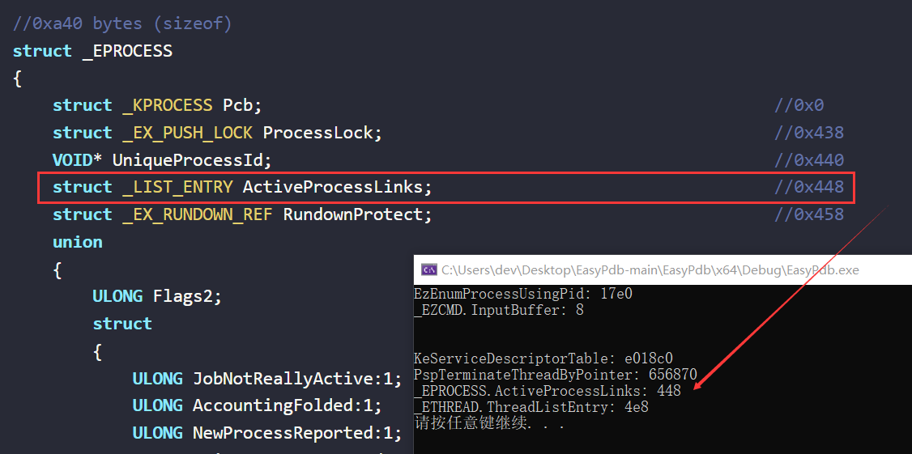

# EasyPdb

A very simple C library for download pdb, get rva of function, global variable and offset from struct.




## usage

```C
int test2()
{
	EZPDB pdb = { 0 };

#ifndef _AMD64_
	PVOID OldValue = NULL;
	Wow64DisableWow64FsRedirection(&OldValue);
#endif

	// "http://msdl.blackint3.com:88/download/symbols/"
	DWORD dwError = EzInitPdb(&pdb, "C:\\Windows\\System32\\", "ntoskrnl.exe", TRUE, NULL, "D:\\symboldownload");

#ifndef _AMD64_
	Wow64RevertWow64FsRedirection(&OldValue);
#endif

	if (dwError != 0)
	{
		printf("init pdb error: %x\n", dwError);
		return dwError;
	}

	dwError = EzLoadPdb(&pdb);
	if (dwError != 0)
	{
		printf("load pdb error: %x\n", dwError);
		return dwError;
	}
	DWORD rva = 0;
	DWORD Offset = 0;
	if (EzGetRva(&pdb, "KeServiceDescriptorTable", &rva))
	{
		printf("KeServiceDescriptorTable: %x\n", rva);
	}

	if (EzGetRva(&pdb, "PspTerminateThreadByPointer", &rva))
	{
		printf("PspTerminateThreadByPointer: %x\n", rva);
	}

	if (EzGetOffset(&pdb, "_EPROCESS", L"ActiveProcessLinks", &Offset))
	{
		printf("_EPROCESS.ActiveProcessLinks: %x\n", Offset);
	}
	if (EzGetOffset(&pdb, "_ETHREAD", L"ThreadListEntry", &Offset))
	{
		printf("_ETHREAD.ThreadListEntry: %x\n", Offset);
	}

	EzPdbUnload(&pdb);

	return 0;
}
```